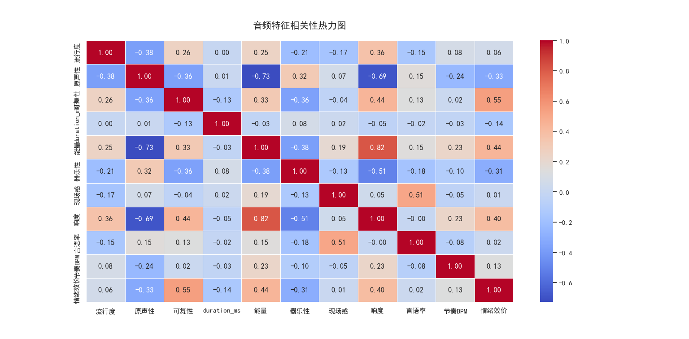
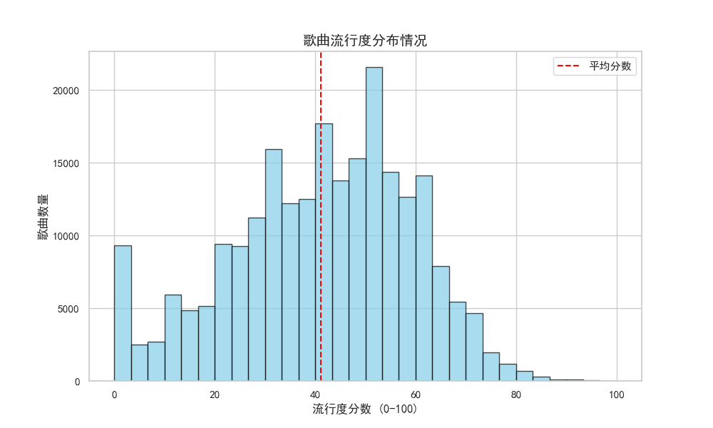
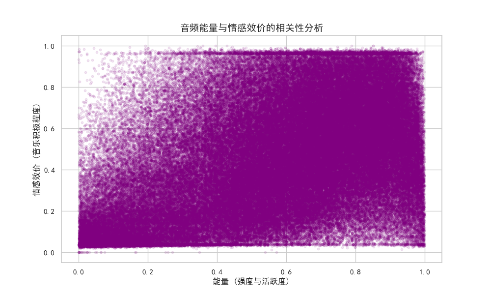
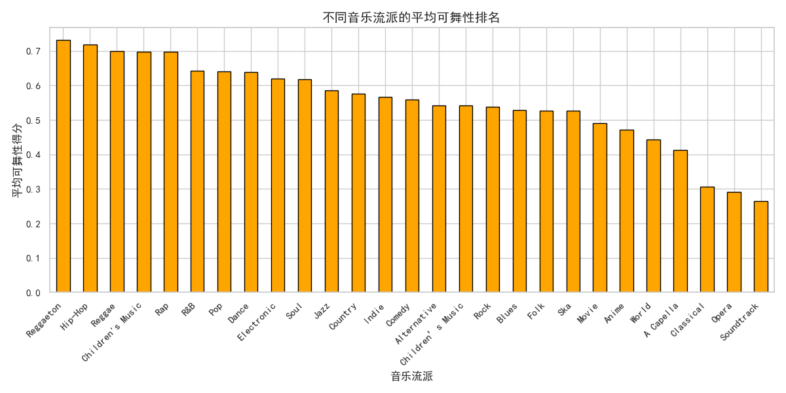

# Spotify 全球音乐特征挖掘与爆款预测项目

## 📌 项目背景
本项目基于 Spotify 23w+ 条音乐数据记录，通过探索性数据分析 (EDA) 和机器学习建模，深入探究影响歌曲流行度的核心特征，并构建了热门歌曲预测系统。

## 🚀 项目关键洞察报告
* **数据库规模**：共有 232,725 条歌曲记录。
* **流行度现状**：全平台平均流行度为 41.13 分。
* **最强节奏感**：分析显示 **Reggaeton** 是最适合舞蹈的曲风（可舞性：0.73）。
* **核心特征关联**：能量 (Energy) 与响度 (Loudness) 呈现显著的强正相关。
* **模型表现**：最终预测模型 F1-Score 达到 0.82，成功识别驱动流行趋势的核心因子。

## 📊 关键洞察可视化

### A. 音频特征相关性分析
通过热力图发现，响度 (Loudness) 与能量 (Energy) 之间的相关系数极高（0.82），这表明现代流行音乐普遍追求高能量和高响度的听感。

### B. 歌曲流行度分布情况
数据呈现出明显的正态分布特征，大部分歌曲的流行度集中在 30-60 分区间，极高流行度（>80）的歌曲属于稀缺样本。

### C. 能量与情感效价的相关性
散点图揭示了音乐活跃度（Energy）与情绪正向度（Valence）之间的空间分布，为后续的流派聚类分析提供了重要依据。

### D. 不同音乐流派的平均可舞性排名
直方图清晰展示了不同曲风的节奏属性，Reggaeton、Hip-Hop 和 Reggae 位列前三，是最能带动听众律动的流派。

## 🛠️ 技术栈
* **语言**：Python 3.x
* **库**：Pandas, NumPy (数据处理); Matplotlib, Seaborn (数据可视化)
* **算法**：Random Forest (流行度预测), Scikit-Learn (特征工程)

## 📂 文件说明
* `main.py`: 包含数据清洗、特征分析及建模的完整核心代码。
* `SpotifyFeatures.csv`: 原始数据集。
* `images/`: 存放所有分析生成的图表。
